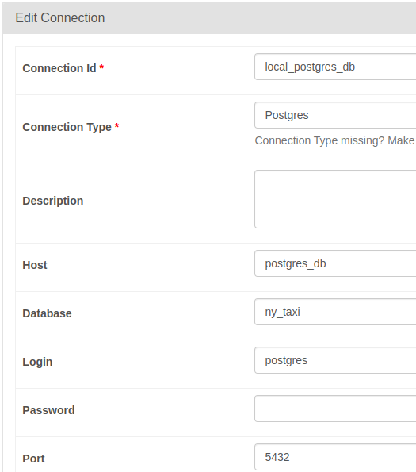

# Airflow DAG for collecting [Green NY Taxi data](https://github.com/DataTalksClub/nyc-tlc-data/releases/tag/green/download) and inserting it into Postgres

## Run Airflow in Docker 

1. Download _docker-compose.yaml_ \
`curl -LfO 'https://airflow.apache.org/docs/apache-airflow/2.10.4/docker-compose.yaml'`
2. Extend airflow docker image by writing custom `Dockerfile` and add the following field in  _docker-compose.yaml_
```
  ...
  # image: ${AIRFLOW_IMAGE_NAME:-apache/airflow:2.10.4}
  build: .
  ...
```
Dockerfile with necessary dependencies:
```
FROM apache/airflow:2.10.4
ADD requirements.txt .
RUN pip install apache-airflow==${AIRFLOW_VERSION} -r requirements.txt
```
3. Create _.env_ file to define environment variables, logins and passwords can also be stored here.
```
mkdir -p ./dags ./logs ./plugins ./config
echo -e "AIRFLOW_UID=$(id -u)" > .env
```
Modify _docker-compose.yaml_ for loading environment variables from _.env_
```
  ...
  user: "${AIRFLOW_UID:-50000}:0"
  env_file:
    - .env
  ...
```
The folders _dags_, _logs_, _plugins_ and _config_ can also be found inside Airflow worker container:

4. Run Airflow
```
docker compose build # Needs to be run only once to build the image
docker compose up airflow-init -d
docker compose up -d
```
## Run Postgres and pgAdmin in Docker
Run the following command inside the folder _postgres_db_
```
docker compose up -d
```
## Connect Postgres and Airflow to the same network
Find the name of the network which is used by Airflow containers
```
docker network ls
```
Connect Postgres to the network
```
docker network connect <xxx_default>  postgres_db
```
The network connections between the containers can be visualized as
```
airflow       Postgres      pgAdmin
   \          /      \         / 
    xxx_default_1    xxx_default_2     
```
## Open web interfaces of Airflow and pgAdmin, and login in them.
```
localhost:8080 # Airflow
localhost:8085 # pgAdmin
```
Create new server in pgAdmin:


## Set up a new _Connection_ in Airflow to Postgres

## Run the DAG in Airflow web interface


