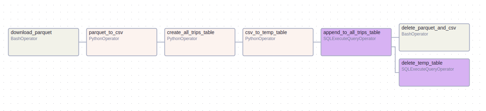

# Airflow DAG to collect data from _.parquet_ files to Postgres.
## (The homework was done locally as I don't have access to GCP)

The data pipeline collects [Yellow Taxi Trip Records](https://www.nyc.gov/site/tlc/about/tlc-trip-record-data.page) between specified dates using catchup and schedule from [cron expression](https://crontab.guru/), to change date range edit the following code in the DAG:
```
parquet_data_ingest = DAG(
    "parquet_data_ingest_to_db",
    schedule_interval="0 6 2 * *", # run every month on the 2nd day at 6 am
    start_date=datetime(2024, 1, 1), # DAG executed at the end of each scheduled interval
    end_date = datetime(2024, 7, 1),# DAG will collect data up to 2024-06-01, i.e. the  end_date is exclusive for this particular schedule
    max_active_runs = 2,
    catchup = True
)
```
The instructions for running Airflow and Postgres in Docker can be found [here](https://github.com/Viktor-Sok/de-bootcamp/tree/main/Module2%3AAirflow_Postgres).

